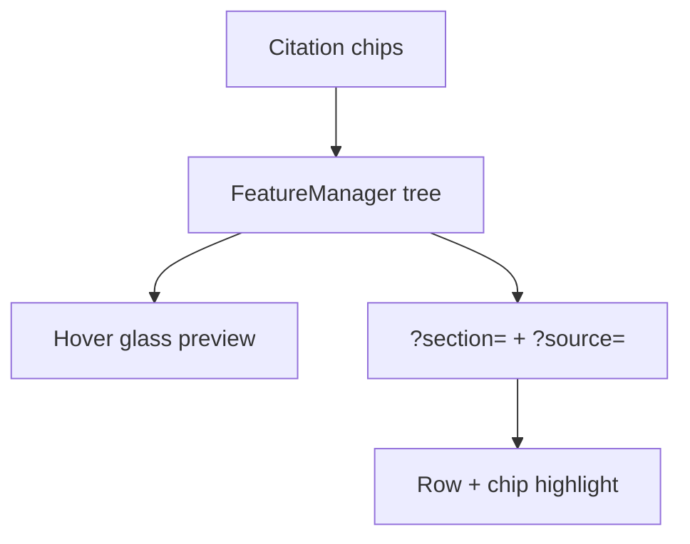

# Phase 1 Analysis — merged spec + walkthrough

**Theme:** One way to preview (hover), one way to select (URL `?section=` + `?source=` + highlight).

Sources: `spec-audit.md`, `walkthrough-friction.md`  
Priority order: **Structural > Workflow > PRD-cited > Polish > Drift**

| ID | Category | Finding | Action | Default in scope? |
|----|----------|---------|--------|-------------------|
| F-1 | Structural | **Triple preview:** tree inline expand + hover card + `InDocSourceOverlay` | **CUT** overlay; **CUT** inline expand; **KEEP** hover | yes |
| F-2 | Structural | **Empty pack** (Risk–Benefit): no `EmptyPackState`, no assemble entry | **ADD** | yes |
| F-3 | Structural | **Pack assemble loading** `?state=assembling` missing | **ADD** | yes |
| F-4 | Structural | Submission **overview** duplicates list → workspace path | **MERGE** — slim overview to activity + stale summary links; list remains primary entry | yes |
| F-5 | Workflow | Tree row **click** does not set `?source=` (citation click does) | **KEEP** tree + **ADD** fix URL sync in workspace | yes |
| F-6 | Workflow | No **PackToolbar** / assemble CTA in tree header | **ADD** (minimal toolbar or tree header actions) | yes |
| F-7 | Workflow | **Promote suggested → pack** not implemented | **ADD** | yes |
| F-8 | PRD-cited | `InheritPackModal` (`?modal=inherit-pack`) missing | **ADD** | yes |
| F-9 | PRD-cited | `SourceMoveConfirmModal` (`?modal=move-source`) missing | **ADD** | yes |
| F-10 | PRD-cited | **Mark curated** without stale blockers / min-items | **MERGE** — wire blockers into existing dialog | yes |
| F-11 | PRD-cited | **Remove / reorder / pin** pack actions missing | **ADD** (tree row menu or toolbar) | optional |
| F-12 | Workflow | `?modal=mark-curated` deep link does not open dialog | **ADD** — honor query param | yes |
| F-13 | Structural | Overlay **“Also in pack”** low signal, often unrelated | **CUT** (with overlay) | yes |
| F-14 | Structural | **“Open in repository”** only needed once | **MERGE** into hover preview footer | yes |
| F-15 | Workflow | **Tri-sync** highlight on deep link works; keep | **KEEP** | — |
| F-16 | Workflow | **Stale banner** on Safety works | **KEEP** | — |
| F-17 | Workflow | **Drag reparent** between repo folders | **KEEP** | — |
| F-18 | Workflow | **Tree search** filter | **KEEP** | — |
| F-19 | Drift | PRD §13 F1 “Sources (N)” drawer language | **Drift** — update PRD note in scope comments only; UI stays tree-first | doc only |
| F-20 | Drift | `/sections/[sectionId]` redirect still uses `?pack=open` | **CUT** param; redirect to `?section=` only | yes |
| F-21 | Polish | Four-segment breadcrumb in workspace | **KEEP** (defer) | no |
| F-22 | Orphan | Unused `Drawer.tsx` layout component | **CUT** dead import/file if unused | optional |
| F-23 | PRD-cited | Search **zero results** empty state in tree | **ADD** | optional |
| F-24 | Structural | `/repository` mock page | **KEEP** as hover link target | — |

## CUT/MERGE count (explicit)

**CUT (6):** F-1 overlay, F-1 inline expand, F-13 “Also in pack”, F-20 `?pack=open`, F-22 unused drawer (optional), full overlay panel  
**MERGE (4):** F-4 slim overview, F-10 curated blockers, F-14 repository link → hover footer, preview channels → hover only  
**ADD (9):** F-2, F-3, F-5 fix, F-6, F-7, F-8, F-9, F-10, F-12 (+ optional F-11, F-23)  
**KEEP (6):** hover preview, tree, tri-sync deep link, stale banner, drag reparent, search filter

## Target interaction model

**Removed from target:** persistent `InDocSourceOverlay`, tree chevron excerpt block.

## Stage 3 bundle recommendation

1. **Simplification pass** (CUT/MERGE) — highest ROI, matches locked preference  
2. **Critical path ADD** — empty, assembling, URL sync, modals, toolbar  
3. **Defer** — polish breadcrumb, stress states, full remove/reorder/pin unless scope approved
