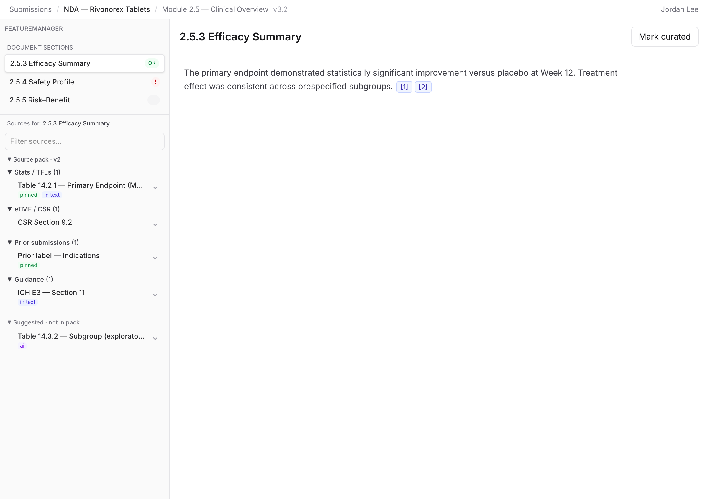
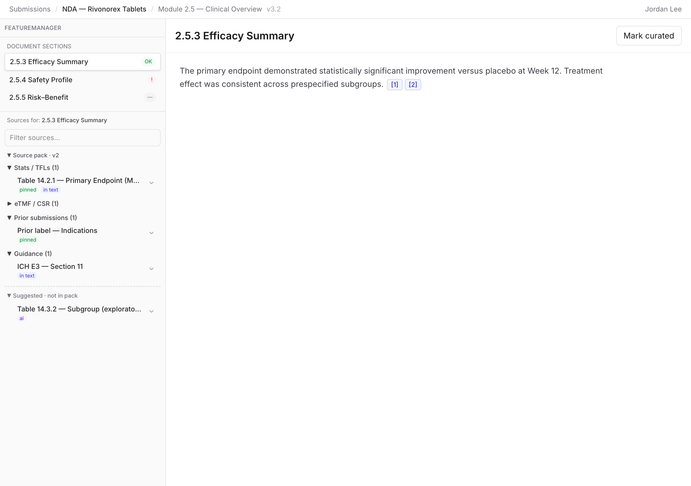
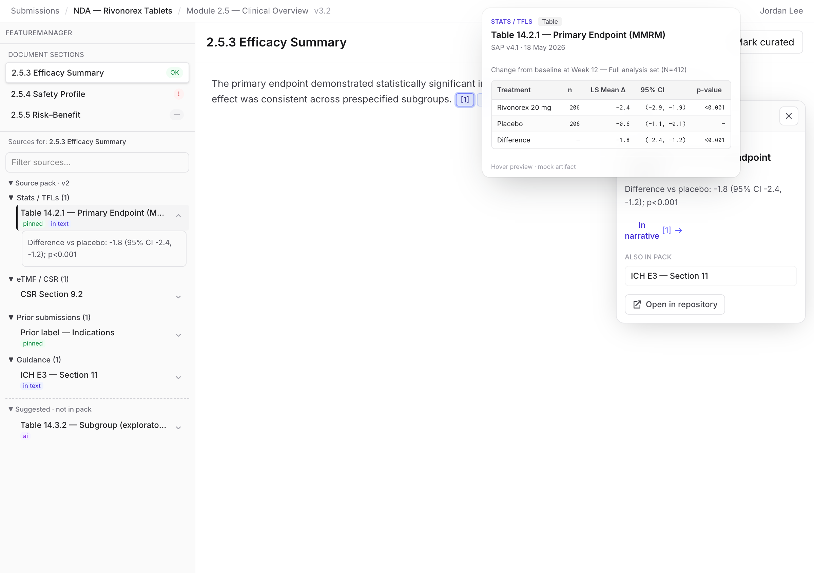
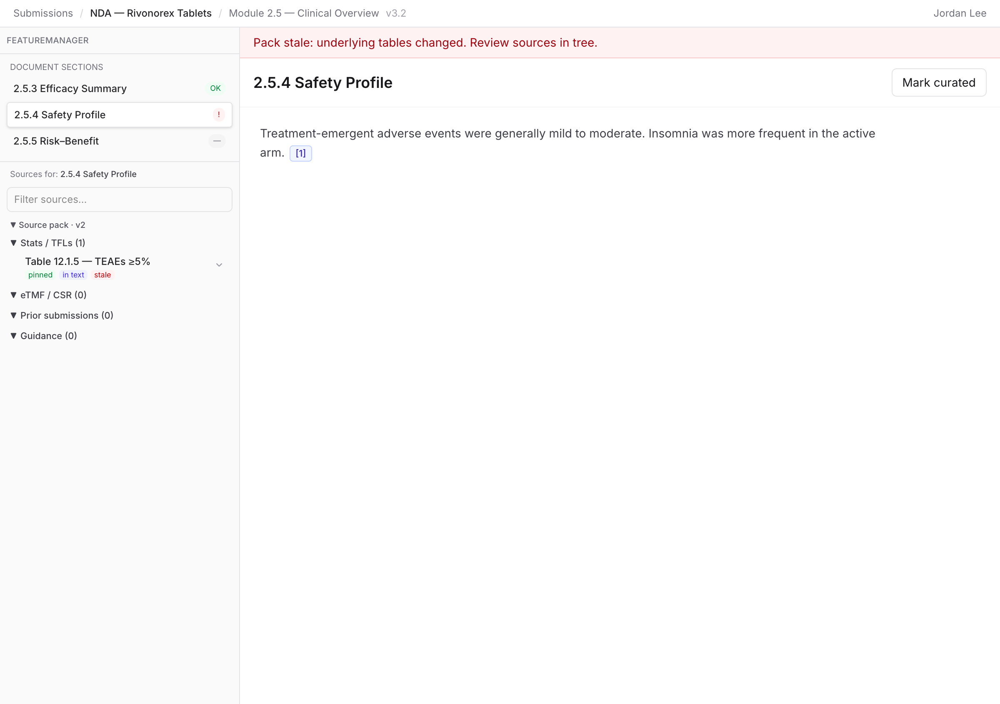
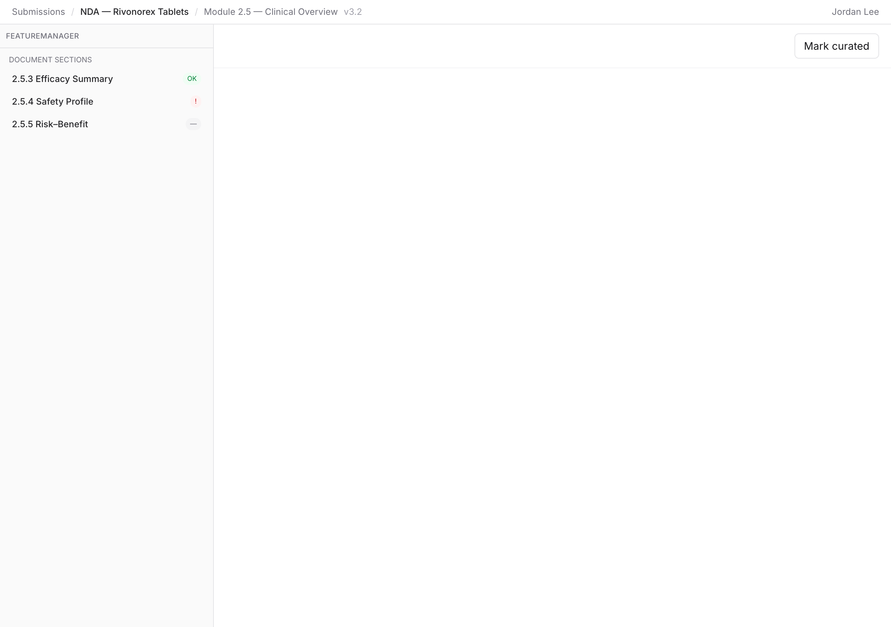
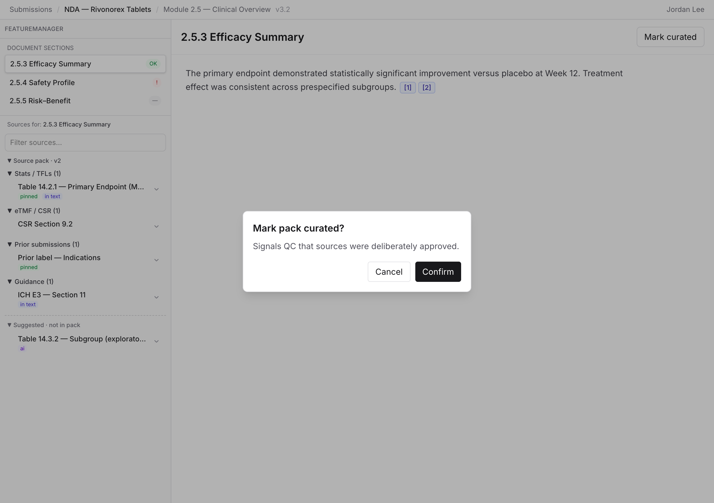
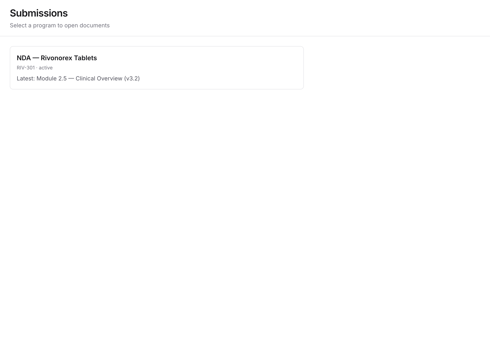
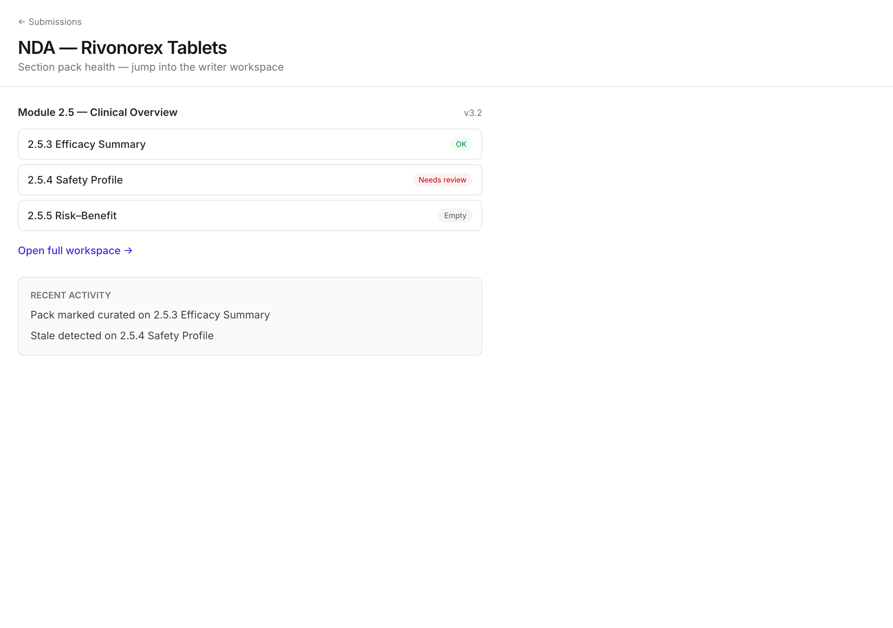

# Persona Walkthrough — Jordan Lee (Medical Writer)

**Server:** http://localhost:3053  
**Persona goal:** Curate a section source pack, verify citations, resolve stale pack, mark curated when ready.

Screenshots: `.dress-up/screens/01-*.png` … `10-*.png`

---

## Flow 1 — Land workspace → Efficacy → scan tree

**Route:** `/submissions/…/documents/…?section=s-efficacy`

| Observation | Friction type |
|---------------|---------------|
| FeatureManager tree visible with document sections + repo folders (Stats, eTMF, Prior submissions, Guidance) | — |
| Section status chips (OK / ! / —) scannable | **KEEP** |
| Suggested folder separated from in-pack | **KEEP** |
| No pack-level toolbar (assemble, version, item count) | **Workflow** — Jordan cannot start empty pack or re-assemble from tree header |

---

## Flow 2 — Hover tree row → preview; click row → selection

| Observation | Friction type |
|---------------|---------------|
| Hover on tree row shows glass preview card (excerpt / table snippet) | **KEEP** — primary detail surface |
| Click on source row did **not** append `?source=` to URL (stayed `?section=s-efficacy` only) | **Workflow** — breaks tri-sync when selecting from tree |
| Persistent in-doc overlay text (“Also in pack”, etc.) not detected after click in this run; overlay may be off-screen or gated | **redundant surface** — when overlay does open, it duplicates hover |

  

**Tag:** `redundant surface` — tree chevron **inline expand** (excerpt block under row) + hover card + optional overlay = three preview channels.

---

## Flow 3 — Citation `[1]` → tri-sync

| Observation | Friction type |
|---------------|---------------|
| Click `[1]` updates URL to `?section=s-efficacy&source=src-tfl-primary` | **KEEP** |
| Tree row highlight + chip state align on citation path | **KEEP** |
| Tree **click** path weaker than citation path for URL sync | **Workflow** |

---

## Flow 4 — Safety (stale)

| Observation | Friction type |
|---------------|---------------|
| Stale banner + row badge visible (2 stale-related strings) | **KEEP** |
| No “review replacements” or replace-source action | **PRD-cited** |

---

## Flow 5 — Risk–Benefit (empty pack)

| Observation | Friction type |
|---------------|---------------|
| Section shows 0 in-pack folders; no `EmptyPackState`, no “Assemble pack” CTA | **PRD-cited** |
| Jordan cannot complete JTBD “start pack for empty section” | **Structural** |

---

## Flow 6 — Mark curated

| Observation | Friction type |
|---------------|---------------|
| `?modal=mark-curated` deep link did not open dialog (0 `role=dialog`) | **Workflow** — modal may be header-button only |
| Header “Mark curated” exists without stale-blocker guardrails | **PRD-cited** |

---

## Flow 7 — Submissions list vs overview vs workspace

| Observation | Friction type |
|---------------|---------------|
| Submissions list deep-links to document workspace | **KEEP** |
| Submission overview repeats section health list — extra hop if user lands overview first | **Structural** — consider slim overview to activity/links only |
| Overview useful for cross-section stale scan before opening doc | **KEEP** (if slimmed, not removed entirely) |

  

---

## Flow 8 — Deep link `?source=` + drag reparent

| Observation | Friction type |
|---------------|---------------|
| `?section=s-efficacy&source=src-sap-primary` loads with selection/highlight | **KEEP** |
| Drag reparent between repo folders not exercised in automation (discoverability unknown) | — |

---

## Friction summary (by type)

| Type | Count | Examples |
|------|-------|----------|
| **redundant surface** | 3 | Overlay panel, tree inline expand, “Also in pack” |
| **Structural** | 2 | Empty pack missing; overview hop |
| **Workflow** | 3 | Tree click → no `?source=`; mark-curated URL; no assemble |
| **PRD-cited** | 4 | EmptyPackState, inherit/move modals, curated blockers |
| **Polish** | 1 | Long breadcrumb |

## Interaction model recommendation

**One way to preview:** hover glass card only (CUT inline expand + CUT persistent overlay).  
**One way to select:** click tree row or citation → always writes `?section=` + `?source=` → chip + row highlight.
